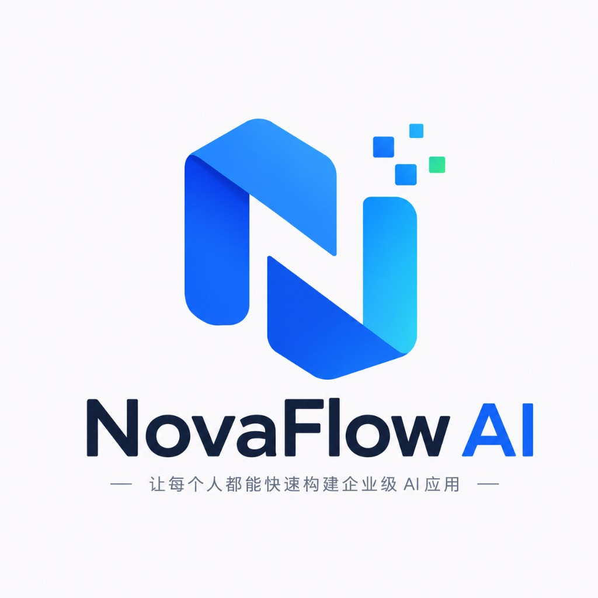
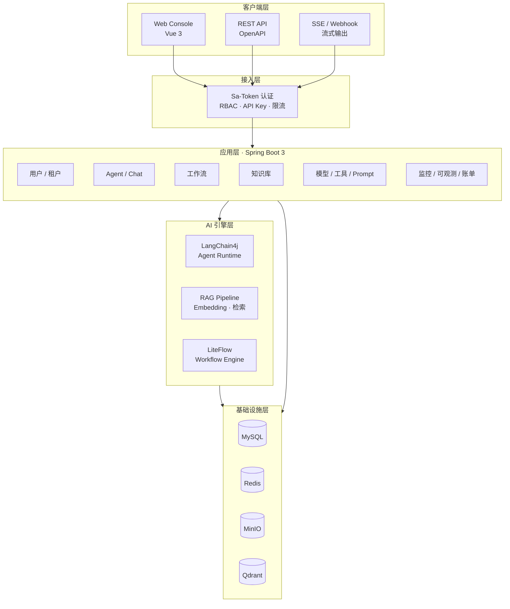
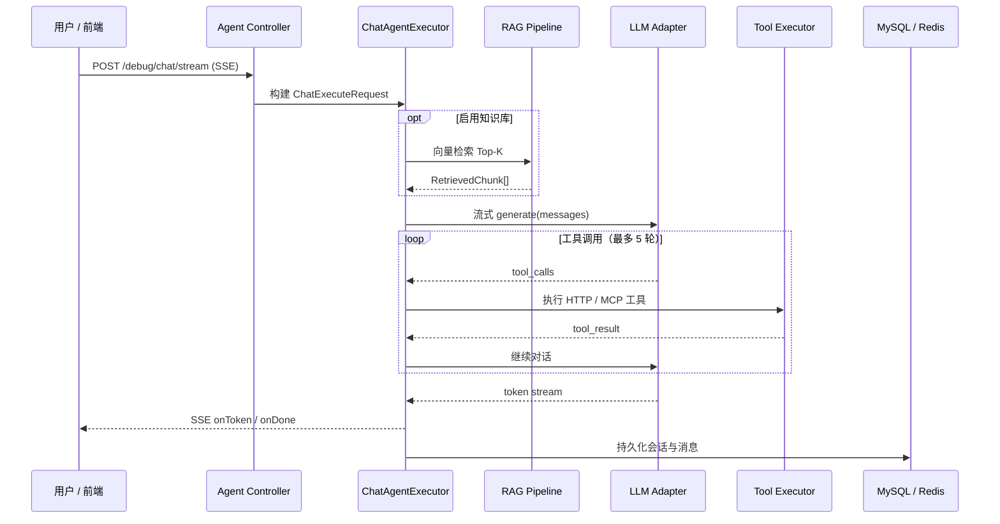
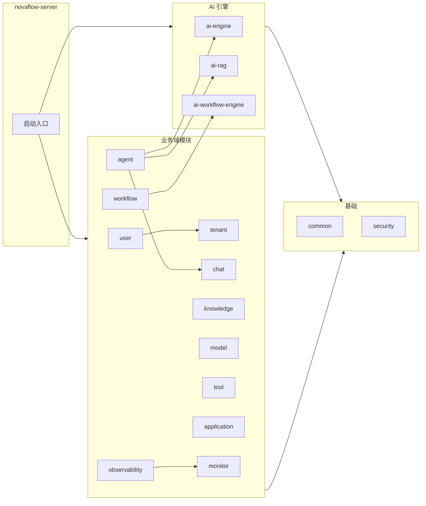

<div align="center">

<p style="margin-top: 28px;">
  
</p>

<br/>

**企业级 AI Agent 开发与运行平台**

*Build Intelligent Agents Faster — 让企业快速构建下一代 AI 应用*

<br/>

[](https://openjdk.org/)
[](https://spring.io/projects/spring-boot)
[](https://vuejs.org/)
[](https://www.typescriptlang.org/)
[](https://maven.apache.org/)

[](https://sa-token.cc/)
[](https://mybatis-flex.com/)
[](https://docs.langchain4j.dev/)
[](https://liteflow.cc/)
[](https://antdv.com/)

[](https://gitee.com/yangleduo7788/nova-flow-ai/stargazers)
[](https://gitee.com/yangleduo7788/nova-flow-ai/members)
[](./pom.xml)

<br/>

[功能特性](#-功能特性) ·
[架构设计](#-架构设计) ·
[模块说明](#-模块说明) ·
[快速开始](#-快速开始) ·
[生产部署](#-生产部署私有化) ·
[文档](#-文档)

</div>

### v1.0 范围说明

- **Multi-Agent 工作流节点**：工作流编排器支持 Agent 节点，可在流程中调用已发布 Agent。
- **私有化一键部署**：`deploy/docker-compose.prod.yml` 提供 Server + Web 镜像与完整基础设施栈。
- **OpenTelemetry**：Workflow / Agent 执行 Span 上报；可选 OTLP 或 Langfuse 集成。
- **平台超管 / 审计日志 / 全局搜索**：租户 CRUD、操作审计、顶栏全局搜索（见菜单与 `/changelog`）。
- **Open API 安全**：服务端集成使用 `nf_live_` API Key；网页嵌入使用受限 `nf_embed_` Token，且必须携带 `X-Caller-Id` 隔离终端用户会话。
- **生产部署**：使用 `spring.profiles.active=prod` 启动，并设置强随机 `NOVAFLOW_CRYPTO_KEY`；或使用 Docker Compose 一键部署（见下方「生产部署」章节）。
- **v1.1 规划（未纳入本版本）**：SSO、部门组织架构、成本分摊报表、外部告警通道（邮件/Webhook）。

---

## 📖 项目简介

NovaFlow AI 是面向 **Java 企业技术栈** 的下一代 AI Agent 开发与运行平台。采用**模块化单体**架构，提供 Agent 编排、工作流引擎、知识库 RAG、工具市场（MCP）、多租户 RBAC、全链路可观测等能力，支持私有化部署与 SaaS 多租户场景。

| 维度 | 说明 |
|------|------|
| **定位** | 企业级 AI Agent Operating System |
| **架构** | Modular Monolith（模块化单体，可按域拆分微服务） |
| **后端** | Java 21 + Spring Boot 3 + MyBatis-Flex |
| **前端** | Vue 3 + TypeScript + Vite + Ant Design Vue |
| **AI 引擎** | LangChain4j（Agent）+ LiteFlow（工作流） |
| **存储** | MySQL · Redis · MinIO · Qdrant |

---

## ✨ 功能特性

| 模块 | 能力 |
|------|------|
| 🤖 **Agent Studio** | 可视化创建、调试、发布 Agent；支持流式对话、工具调用、RAG 增强 |
| 🔀 **工作流 Studio** | Vue Flow 可视化编排，LiteFlow 引擎执行 |
| 📚 **知识库 Hub** | 文档上传、分块、Embedding、向量检索（MinIO + Qdrant） |
| 🧠 **模型中心** | 多提供商接入、API Key 加密存储、连通性测试 |
| 🔧 **工具市场** | HTTP 工具、MCP Server、Skill 插件 |
| 📝 **Prompt 管理** | 模板库、版本管理、在线测试 |
| 🏢 **多租户** | 租户 / 工作空间 / 组织成员 / RBAC 权限 |
| 📊 **可观测性** | 运行监控、调用日志、链路追踪、账单与用量 |

---

## 🏗 架构设计

### 系统分层



### Agent 对话核心流程



### 模块依赖关系



---

## 📦 模块说明

```
NovaFlow-AI/
├── novaflow-server/               # 🚀 Spring Boot 启动入口
├── novaflow-web/                  # 🖥  Vue 3 前端控制台
│
├── novaflow-common/               # 公共工具、异常、跨模块接口
├── novaflow-security/             # 认证授权、API Key、限流
├── novaflow-tenant/               # 租户 / 工作空间实体
├── novaflow-user/                 # 用户、角色、权限、组织管理
│
├── novaflow-agent/                # Agent CRUD、调试、发布
├── novaflow-chat/                 # 会话与消息持久化
├── novaflow-workflow/             # 工作流编排与执行
├── novaflow-knowledge/            # 知识库管理
├── novaflow-model/                # 模型提供商与配置
├── novaflow-tool/                 # 工具市场、MCP、Skill
├── novaflow-prompt/               # Prompt 模板管理
├── novaflow-application/          # 应用 CRUD、发布
├── novaflow-dashboard/            # 工作台聚合 API
├── novaflow-monitor/              # 运行监控、健康检查
├── novaflow-observability/        # 链路追踪、可观测概览
├── novaflow-billing/              # 账单与用量
│
├── novaflow-ai-engine/            # LangChain4j Agent 运行时
├── novaflow-ai-rag/               # RAG 管道（解析、Embedding、检索）
├── novaflow-ai-workflow-engine/   # LiteFlow 工作流引擎封装
│
├── docs/                          # 设计文档
├── docker-compose.yml             # 本地全量基础设施
├── docker-compose.local.yml       # 仅 Redis + Qdrant（MySQL 远程）
└── deploy/                        # 生产私有化部署（Dockerfile + compose）
```

---

## 🛠 技术栈

### 后端

| 技术 | 版本 | 说明 |
|------|------|------|
| Java | 21 | LTS |
| Spring Boot | 3.3.5 | Web · JDBC · Redis · Actuator |
| Sa-Token | 1.39.0 | 认证与会话 |
| MyBatis-Flex | 1.9.9 | ORM |
| Flyway | — | 数据库迁移 |
| LangChain4j | 0.36.2 | LLM / Agent 抽象 |
| LiteFlow | 2.12.4 | 工作流规则引擎 |
| SpringDoc | 2.6.0 | OpenAPI 文档 |

### 前端

| 技术 | 版本 | 说明 |
|------|------|------|
| Vue | 3.5 | 组合式 API |
| TypeScript | 6.0 | 类型安全 |
| Vite | 8.2 | 构建工具 |
| Ant Design Vue | 4.2 | UI 组件库 |
| Vue Flow | 1.48 | 工作流可视化 |
| Pinia | 4.0 | 状态管理 |
| ECharts | 6.1 | 图表 |

### 基础设施

| 组件 | 用途 | 默认端口 |
|------|------|----------|
| MySQL 8 | 业务数据 | 3306 |
| Redis 7 | 登录态 / 会话记忆 | 6379 |
| MinIO | 知识库文档对象存储 | 9000 / 9001 |
| Qdrant | 向量检索（gRPC） | 6334（REST 6333） |

---

## 🚀 快速开始

### 环境要求

- **JDK** 21+
- **Maven** 3.9+
- **Node.js** 20+（前端）
- **Docker**（本地基础设施，可选）

### 1️⃣ 配置环境变量

```bash
cp .env.example .env
# 按需修改数据库、Redis、MinIO、Qdrant 等连接信息
```

### 2️⃣ 启动基础设施

**全量本地环境**（MySQL + Redis + MinIO + Qdrant）：

```bash
docker compose up -d
```

**混合环境**（MySQL 连远程，仅本地 Redis + Qdrant）：

```bash
docker compose -f docker-compose.local.yml up -d
```

| 服务 | 地址 | 账号 | 密码 |
|------|------|------|------|
| MySQL | `localhost:3306` | `root` | `root` |
| Redis | `localhost:6379` | — | `redis123` |
| MinIO API | `localhost:9000` | `minioadmin` | `minioadmin123` |
| MinIO 控制台 | [localhost:9001](http://localhost:9001) | 同上 | 同上 |
| Qdrant Dashboard | [localhost:6333/dashboard](http://localhost:6333/dashboard) | — | 无（本地默认） |

> **Qdrant**：后端通过 **gRPC `6334`** 连接（见 `application.yml` → `novaflow.qdrant`），6333 为 REST / Dashboard。
>
> **RAG**：需启动 MinIO + Qdrant，并在模型中心配置 Embedding 模型。
>
> **PDF**：图片型 PDF 暂不支持 OCR，请上传 PPTX 或可搜索文字的 PDF。

### 3️⃣ 启动后端

```bash
mvn clean package -DskipTests
java -jar novaflow-server/target/novaflow-server-0.1.0-SNAPSHOT.jar
```

| 服务 | 地址 |
|------|------|
| API | http://localhost:8080 |
| Swagger UI | http://localhost:8080/swagger-ui.html |
| 健康检查 | http://localhost:8080/api/v1/health |

### 4️⃣ 启动前端

```bash
cd novaflow-web
npm install
npm run dev
```

前端控制台：http://localhost:3000

**演示账号**（首次启动自动初始化）：

| 邮箱 | 密码 |
|------|------|
| `admin@novaflow.ai` | `Admin123!` |

---

## 🏭 生产部署（私有化）

适用于内网 / 私有化环境，一键拉起 **MySQL、Redis、MinIO、Qdrant、后端、前端（Nginx）**。

### 环境要求

- **Docker** 24+ 与 **Docker Compose** v2
- 建议内存 ≥ 8 GB，磁盘 ≥ 20 GB

### 1️⃣ 准备配置

```bash
cp deploy/.env.prod.example .env
```

编辑项目根目录 `.env`，至少修改以下项：

| 变量 | 说明 |
|------|------|
| `MYSQL_ROOT_PASSWORD` | MySQL root 密码 |
| `REDIS_PASSWORD` | Redis 密码 |
| `MINIO_ACCESS_KEY` / `MINIO_SECRET_KEY` | MinIO 凭证 |
| `NOVAFLOW_CRYPTO_KEY` | 模型 API Key 加密密钥（强随机，≥32 字符） |
| `CORS_ALLOWED_ORIGIN` | 前端访问域名，如 `https://ai.example.com` |

### 2️⃣ 构建并启动

```bash
docker compose -f deploy/docker-compose.prod.yml up -d --build
```

| 服务 | 默认地址 | 说明 |
|------|----------|------|
| Web 控制台 | http://localhost（`WEB_PORT`） | Nginx 反代前端 + `/api` |
| 后端 API | http://localhost:8080（`SERVER_PORT`） | 也可仅通过 Web 反代访问 |
| MinIO 控制台 | 需自行映射或进入容器 | 默认未对外暴露 9001 |

查看日志：

```bash
docker compose -f deploy/docker-compose.prod.yml logs -f server web
```

停止并清理：

```bash
docker compose -f deploy/docker-compose.prod.yml down
# 保留数据卷；加 -v 可删除 MySQL/Redis/MinIO/Qdrant 数据
```

### 3️⃣ OpenTelemetry / Langfuse（可选）

在 `.env` 中启用：

```env
OTEL_ENABLED=true
LANGFUSE_PUBLIC_KEY=pk-lf-...
LANGFUSE_SECRET_KEY=sk-lf-...
LANGFUSE_HOST=https://cloud.langfuse.com
```

未配置 Langfuse 时，可改用通用 OTLP 端点：

```env
OTEL_ENABLED=true
OTEL_EXPORTER_OTLP_ENDPOINT=http://your-collector:4318
```

### 4️⃣ 非容器部署（JAR + 静态资源）

仅基础设施用 Docker，应用进程在宿主机运行：

```bash
# 基础设施
docker compose up -d

# 后端（生产配置）
export SPRING_PROFILES_ACTIVE=prod
export NOVAFLOW_CRYPTO_KEY=your-strong-key
mvn -pl novaflow-server -am package -DskipTests
java -jar novaflow-server/target/novaflow-server-0.1.0-SNAPSHOT.jar

# 前端构建后由 Nginx 托管 dist/
cd novaflow-web && npm ci && npm run build
```

生产配置见 `novaflow-server/src/main/resources/application-prod.yml`（关闭 Swagger、启用 Flyway 校验等）。

---

## 📡 API 概览

| 方法 | 路径 | 说明 |
|------|------|------|
| `GET` | `/api/v1/health` | 健康检查 |
| `GET` | `/api/v1/dashboard/overview` | 工作台概览 |
| `GET` | `/api/v1/agents` | Agent 列表 |
| `POST` | `/api/v1/agents/{id}/debug/chat/stream` | Agent 流式调试（SSE） |
| `GET` | `/api/v1/knowledge-bases` | 知识库列表 |
| `GET` | `/api/v1/trace/spans` | 链路追踪 |
| `GET` | `/api/v1/monitor/observability` | 可观测性概览 |

完整接口见 Swagger UI 或 [系统架构设计 · API 章节](docs/系统架构设计.md)。

---

## 📚 文档

| 文档 | 说明 |
|------|------|
| [PRD](docs/PRD.md) | 产品需求与功能设计 |
| [系统架构设计](docs/系统架构设计.md) | 模块拆分、核心流程、部署架构 |
| [数据库设计](docs/数据库设计.md) | 表结构与 ER 关系 |

---

## 🔗 仓库地址

| 平台 | 地址 |
|------|------|
| Gitee | https://gitee.com/yangleduo7788/nova-flow-ai |
| GitHub | https://github.com/Yangleduo00337788/NovaFlow-AI |

---

<div align="center">

**NovaFlow AI** — 让企业快速构建下一代 AI 应用

</div>
