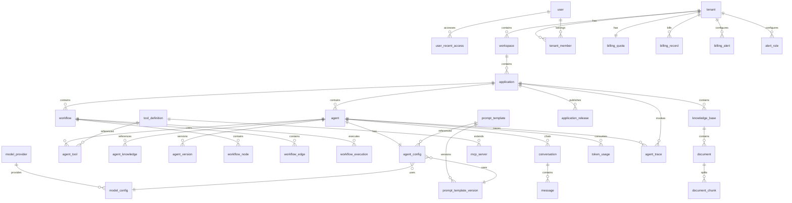

# NovaFlow AI 数据库设计

> 版本：v1.2  
> 日期：2026-08-07  
> 状态：已与 UI 原型完全对齐  
> 变更：新增 user_recent_access 表、统一 UI 菜单命名  
> 数据库：MySQL 8.0  
> 字符集：utf8mb4  
> 排序规则：utf8mb4_unicode_ci

---

## 目录

1. [设计规范](#1-设计规范)
2. [ER 模型](#2-er-模型)
3. [用户与权限](#3-用户与权限)
4. [租户体系](#4-租户体系)
5. [Agent 体系](#5-agent-体系)
6. [Workflow 体系](#6-workflow-体系)
7. [Knowledge 体系](#7-knowledge-体系)
8. [Model 体系](#8-model-体系)
9. [Tool 体系](#9-tool-体系)
10. [Prompt 体系](#10-prompt-体系)
11. [费用与计费](#11-费用与计费)
12. [对话体系](#12-对话体系)
13. [统计与日志](#13-统计与日志)
14. [索引设计汇总](#14-索引设计汇总)

---

## 1. 设计规范

### 1.1 命名规范

| 规则 | 示例 |
|------|------|
| 表名：小写 + 下划线，单数 | `user`, `agent_config` |
| 字段名：小写 + 下划线 | `created_at`, `tenant_id` |
| 主键：统一 `id`，BIGINT UNSIGNED AUTO_INCREMENT | `id` |
| 外键字段：`{关联表单数}_id` | `tenant_id`, `agent_id` |
| 布尔字段：`is_` 前缀 | `is_deleted`, `is_enabled` |
| 时间字段：`_at` 后缀 | `created_at`, `updated_at` |
| 枚举字段：TINYINT 或 VARCHAR | `status TINYINT` |

### 1.2 通用字段

每张业务表必须包含：

```sql
`id`            BIGINT UNSIGNED  NOT NULL AUTO_INCREMENT COMMENT '主键',
`tenant_id`     BIGINT UNSIGNED  NOT NULL DEFAULT 0  COMMENT '租户ID，0表示平台级',
`created_at`    DATETIME         NOT NULL DEFAULT CURRENT_TIMESTAMP COMMENT '创建时间',
`updated_at`    DATETIME         NOT NULL DEFAULT CURRENT_TIMESTAMP ON UPDATE CURRENT_TIMESTAMP COMMENT '更新时间',
`created_by`    BIGINT UNSIGNED  NULL     COMMENT '创建人ID',
`updated_by`    BIGINT UNSIGNED  NULL     COMMENT '更新人ID',
`is_deleted`    TINYINT(1)       NOT NULL DEFAULT 0  COMMENT '逻辑删除：0-否 1-是',
```

### 1.3 数据类型约定

| 场景 | 类型 | 说明 |
|------|------|------|
| 主键/外键 | BIGINT UNSIGNED | 支持海量数据 |
| 短文本 | VARCHAR(64/128/255) | 名称、标题 |
| 长文本 | TEXT / MEDIUMTEXT | 描述、Prompt |
| 金额/分数 | DECIMAL(12,4) | 精确计算 |
| 状态/枚举 | TINYINT | 节省空间 |
| 配置/JSON | JSON | 灵活配置 |
| 时间 | DATETIME | 统一时区 UTC+8 |

---

## 2. ER 模型

### 2.1 全局 ER 关系图



### 2.2 模块 ER 分组

```
┌─────────────────────────────────────────────────────────────────┐
│                        用户与权限                                 │
│  user ←→ tenant_member ←→ tenant ←→ role ←→ permission        │
│    └── user_recent_access（Dashboard 最近使用）                  │
│                              ↕                                   │
│                        role_permission                           │
└─────────────────────────────────────────────────────────────────┘

┌─────────────────────────────────────────────────────────────────┐
│                        租户与应用                                 │
│  tenant → workspace → application → application_release          │
│       → billing_quota / billing_record / billing_alert           │
└─────────────────────────────────────────────────────────────────┘

┌─────────────────────────────────────────────────────────────────┐
│                        Prompt 体系                                │
│  prompt_template → prompt_template_version                       │
│                 → agent_config（引用/复制）                        │
└─────────────────────────────────────────────────────────────────┘

┌─────────────────────────────────────────────────────────────────┐
│                        Agent 体系                                  │
│  application → agent → agent_config                                │
│                    → agent_tool → tool_definition                │
│                    → agent_knowledge → knowledge_base            │
│                    → agent_version                                 │
└─────────────────────────────────────────────────────────────────┘

┌─────────────────────────────────────────────────────────────────┐
│                        Workflow 体系                               │
│  application → workflow → workflow_node                          │
│                         → workflow_edge                          │
│                         → workflow_execution                     │
└─────────────────────────────────────────────────────────────────┘

┌─────────────────────────────────────────────────────────────────┐
│                        Knowledge 体系                              │
│  application → knowledge_base → document → document_chunk        │
└─────────────────────────────────────────────────────────────────┘

┌─────────────────────────────────────────────────────────────────┐
│                        对话与统计                                  │
│  agent → conversation → message                                  │
│       → token_usage                                              │
│       → agent_trace → trace_span                                 │
└─────────────────────────────────────────────────────────────────┘
```

---

## 3. 用户与权限

### 3.1 user（用户表）

```sql
CREATE TABLE `user` (
    `id`              BIGINT UNSIGNED  NOT NULL AUTO_INCREMENT COMMENT '主键',
    `username`        VARCHAR(64)      NOT NULL                COMMENT '用户名',
    `email`           VARCHAR(128)     NOT NULL                COMMENT '邮箱',
    `password_hash`   VARCHAR(256)     NOT NULL                COMMENT '密码哈希（BCrypt）',
    `nickname`        VARCHAR(64)      NULL                    COMMENT '昵称',
    `avatar_url`      VARCHAR(512)     NULL                    COMMENT '头像URL',
    `phone`           VARCHAR(20)      NULL                    COMMENT '手机号',
    `status`          TINYINT          NOT NULL DEFAULT 1      COMMENT '状态：0-禁用 1-正常',
    `last_login_at`   DATETIME         NULL                    COMMENT '最后登录时间',
    `last_login_ip`   VARCHAR(45)      NULL                    COMMENT '最后登录IP',
    `created_at`      DATETIME         NOT NULL DEFAULT CURRENT_TIMESTAMP,
    `updated_at`      DATETIME         NOT NULL DEFAULT CURRENT_TIMESTAMP ON UPDATE CURRENT_TIMESTAMP,
    `is_deleted`      TINYINT(1)       NOT NULL DEFAULT 0,
    PRIMARY KEY (`id`),
    UNIQUE KEY `uk_email` (`email`),
    UNIQUE KEY `uk_username` (`username`)
) ENGINE=InnoDB COMMENT='用户表';
```

### 3.2 role（角色表）

```sql
CREATE TABLE `role` (
    `id`              BIGINT UNSIGNED  NOT NULL AUTO_INCREMENT,
    `tenant_id`       BIGINT UNSIGNED  NOT NULL DEFAULT 0      COMMENT '租户ID，0为系统角色',
    `role_code`       VARCHAR(64)      NOT NULL                COMMENT '角色编码',
    `role_name`       VARCHAR(64)      NOT NULL                COMMENT '角色名称',
    `description`     VARCHAR(256)     NULL                    COMMENT '描述',
    `is_system`       TINYINT(1)       NOT NULL DEFAULT 0      COMMENT '是否系统内置',
    `created_at`      DATETIME         NOT NULL DEFAULT CURRENT_TIMESTAMP,
    `updated_at`      DATETIME         NOT NULL DEFAULT CURRENT_TIMESTAMP ON UPDATE CURRENT_TIMESTAMP,
    `is_deleted`      TINYINT(1)       NOT NULL DEFAULT 0,
    PRIMARY KEY (`id`),
    UNIQUE KEY `uk_tenant_code` (`tenant_id`, `role_code`)
) ENGINE=InnoDB COMMENT='角色表';
```

**系统内置角色：**

| role_code | role_name | 说明 |
|-----------|-----------|------|
| super_admin | 超级管理员 | 平台级；独有 `platform:manage`；组织内不可分配 |
| tenant_admin | 企业管理员 | 本企业最高（无跨租户总控） |
| developer | 开发者 | 本企业 AI 开发 + 监控/账单查看 |
| user | 普通用户 | 仅 `portal:access` |

一人一租户一个角色（`tenant_member.role_id`）。无 `user_role`、无资源 ACL 表。权限码与角色绑定见 [权限体系](./权限体系.md)。

### 3.3 permission（权限表）

```sql
CREATE TABLE `permission` (
    `id`              BIGINT UNSIGNED  NOT NULL AUTO_INCREMENT,
    `permission_code` VARCHAR(128)     NOT NULL                COMMENT '权限编码',
    `permission_name` VARCHAR(64)      NOT NULL                COMMENT '权限名称',
    `module`          VARCHAR(32)      NOT NULL                COMMENT '所属模块',
    `description`     VARCHAR(256)     NULL,
    `created_at`      DATETIME         NOT NULL DEFAULT CURRENT_TIMESTAMP,
    PRIMARY KEY (`id`),
    UNIQUE KEY `uk_code` (`permission_code`)
) ENGINE=InnoDB COMMENT='权限表';
```

### 3.4 role_permission（角色权限关联）

```sql
CREATE TABLE `role_permission` (
    `id`              BIGINT UNSIGNED  NOT NULL AUTO_INCREMENT,
    `role_id`         BIGINT UNSIGNED  NOT NULL,
    `permission_id`   BIGINT UNSIGNED  NOT NULL,
    `created_at`      DATETIME         NOT NULL DEFAULT CURRENT_TIMESTAMP,
    PRIMARY KEY (`id`),
    UNIQUE KEY `uk_role_perm` (`role_id`, `permission_id`)
) ENGINE=InnoDB COMMENT='角色权限关联表';
```

### 3.5 tenant_member（租户成员）

```sql
CREATE TABLE `tenant_member` (
    `id`              BIGINT UNSIGNED  NOT NULL AUTO_INCREMENT,
    `tenant_id`       BIGINT UNSIGNED  NOT NULL,
    `user_id`         BIGINT UNSIGNED  NOT NULL,
    `role_id`         BIGINT UNSIGNED  NOT NULL                COMMENT '角色ID',
    `department_id`   BIGINT UNSIGNED  NULL                    COMMENT '所属部门',
    `status`          TINYINT          NOT NULL DEFAULT 1      COMMENT '0-禁用 1-正常',
    `joined_at`       DATETIME         NOT NULL DEFAULT CURRENT_TIMESTAMP,
    `created_at`      DATETIME         NOT NULL DEFAULT CURRENT_TIMESTAMP,
    `updated_at`      DATETIME         NOT NULL DEFAULT CURRENT_TIMESTAMP ON UPDATE CURRENT_TIMESTAMP,
    `is_deleted`      TINYINT(1)       NOT NULL DEFAULT 0,
    PRIMARY KEY (`id`),
    UNIQUE KEY `uk_tenant_user` (`tenant_id`, `user_id`),
    KEY `idx_user_id` (`user_id`)
) ENGINE=InnoDB COMMENT='租户成员表';
```

成员可通过 `department_id` 挂到部门（可空，表示未分配）。删除部门时会清空该字段，不删成员。

### 3.5.1 department（部门）

租户内树形组织，**不是**授权边界；权限仍只看角色权限码。

```sql
CREATE TABLE `department` (
    `id`              BIGINT UNSIGNED  NOT NULL AUTO_INCREMENT,
    `tenant_id`       BIGINT UNSIGNED  NOT NULL,
    `parent_id`       BIGINT UNSIGNED  NULL,
    `dept_name`       VARCHAR(128)     NOT NULL,
    `sort_order`      INT              NOT NULL DEFAULT 0,
    `created_at`      DATETIME         NOT NULL DEFAULT CURRENT_TIMESTAMP,
    `updated_at`      DATETIME         NOT NULL DEFAULT CURRENT_TIMESTAMP ON UPDATE CURRENT_TIMESTAMP,
    `is_deleted`      TINYINT(1)       NOT NULL DEFAULT 0,
    PRIMARY KEY (`id`),
    KEY `idx_tenant_parent` (`tenant_id`, `parent_id`)
) ENGINE=InnoDB COMMENT='租户部门表';
```

### 3.6 user_recent_access（最近使用）

记录用户最近访问的 Agent、工作流、知识库等资源，支撑 Dashboard「最近使用」列表。

```sql
CREATE TABLE `user_recent_access` (
    `id`              BIGINT UNSIGNED  NOT NULL AUTO_INCREMENT,
    `tenant_id`       BIGINT UNSIGNED  NOT NULL,
    `user_id`         BIGINT UNSIGNED  NOT NULL,
    `resource_type`   VARCHAR(16)      NOT NULL                COMMENT '资源类型：agent/workflow/knowledge_base/application',
    `resource_id`     BIGINT UNSIGNED  NOT NULL                COMMENT '资源ID',
    `resource_name`   VARCHAR(256)     NOT NULL                COMMENT '资源名称（冗余，加速展示）',
    `accessed_at`     DATETIME         NOT NULL DEFAULT CURRENT_TIMESTAMP COMMENT '最近访问时间',
    PRIMARY KEY (`id`),
    UNIQUE KEY `uk_user_resource` (`user_id`, `resource_type`, `resource_id`),
    KEY `idx_tenant_user_time` (`tenant_id`, `user_id`, `accessed_at` DESC)
) ENGINE=InnoDB COMMENT='用户最近访问记录表';
```

**写入时机**：用户打开 Agent 编辑页、工作流编辑器、知识库详情页时 upsert 更新 `accessed_at`。

---

## 4. 租户体系

### 4.1 tenant（租户表）

```sql
CREATE TABLE `tenant` (
    `id`              BIGINT UNSIGNED  NOT NULL AUTO_INCREMENT,
    `tenant_code`     VARCHAR(64)      NOT NULL                COMMENT '租户编码',
    `tenant_name`     VARCHAR(128)     NOT NULL                COMMENT '租户名称',
    `logo_url`        VARCHAR(512)     NULL                    COMMENT 'Logo URL',
    `contact_name`    VARCHAR(64)      NULL                    COMMENT '联系人',
    `contact_email`   VARCHAR(128)     NULL                    COMMENT '联系邮箱',
    `contact_phone`   VARCHAR(20)      NULL                    COMMENT '联系电话',
    `plan_type`       VARCHAR(32)      NOT NULL DEFAULT 'free' COMMENT '套餐：free/pro/enterprise',
    `status`          TINYINT          NOT NULL DEFAULT 1      COMMENT '0-禁用 1-正常 2-试用',
    `expire_at`       DATETIME         NULL                    COMMENT '到期时间',
    `max_members`     INT              NOT NULL DEFAULT 3      COMMENT '最大成员数',
    `max_agents`      INT              NOT NULL DEFAULT 5      COMMENT '最大Agent数',
    `max_knowledge`   INT              NOT NULL DEFAULT 1      COMMENT '最大知识库数',
    `max_storage_mb`  INT              NOT NULL DEFAULT 100    COMMENT '最大存储MB',
    `monthly_token_quota` BIGINT       NOT NULL DEFAULT 100000 COMMENT '月Token配额',
    `config`          JSON             NULL                    COMMENT '租户配置',
    `created_at`      DATETIME         NOT NULL DEFAULT CURRENT_TIMESTAMP,
    `updated_at`      DATETIME         NOT NULL DEFAULT CURRENT_TIMESTAMP ON UPDATE CURRENT_TIMESTAMP,
    `is_deleted`      TINYINT(1)       NOT NULL DEFAULT 0,
    PRIMARY KEY (`id`),
    UNIQUE KEY `uk_tenant_code` (`tenant_code`)
) ENGINE=InnoDB COMMENT='租户表';
```

### 4.2 workspace（工作空间）

```sql
CREATE TABLE `workspace` (
    `id`              BIGINT UNSIGNED  NOT NULL AUTO_INCREMENT,
    `tenant_id`       BIGINT UNSIGNED  NOT NULL,
    `workspace_name`  VARCHAR(128)     NOT NULL                COMMENT '工作空间名称',
    `description`     VARCHAR(512)     NULL,
    `icon`            VARCHAR(64)      NULL                    COMMENT '图标标识',
    `is_default`      TINYINT(1)       NOT NULL DEFAULT 0      COMMENT '是否默认工作空间',
    `created_by`      BIGINT UNSIGNED  NULL,
    `created_at`      DATETIME         NOT NULL DEFAULT CURRENT_TIMESTAMP,
    `updated_at`      DATETIME         NOT NULL DEFAULT CURRENT_TIMESTAMP ON UPDATE CURRENT_TIMESTAMP,
    `is_deleted`      TINYINT(1)       NOT NULL DEFAULT 0,
    PRIMARY KEY (`id`),
    KEY `idx_tenant_id` (`tenant_id`)
) ENGINE=InnoDB COMMENT='工作空间表';
```

### 4.3 application（应用表）

```sql
CREATE TABLE `application` (
    `id`              BIGINT UNSIGNED  NOT NULL AUTO_INCREMENT,
    `tenant_id`       BIGINT UNSIGNED  NOT NULL,
    `workspace_id`    BIGINT UNSIGNED  NOT NULL,
    `app_name`        VARCHAR(128)     NOT NULL                COMMENT '应用名称',
    `description`     VARCHAR(512)     NULL,
    `icon`            VARCHAR(64)      NULL,
    `app_type`        VARCHAR(32)      NOT NULL DEFAULT 'agent' COMMENT '类型：agent/workflow/mixed',
    `default_agent_id` BIGINT UNSIGNED NULL                    COMMENT '默认入口 Agent',
    `publish_status`  TINYINT          NOT NULL DEFAULT 0      COMMENT '0-草稿 1-已发布 2-已下线',
    `access_type`     VARCHAR(16)      NOT NULL DEFAULT 'team' COMMENT '访问：public/team/private',
    `invoke_count`    BIGINT           NOT NULL DEFAULT 0      COMMENT '累计调用次数（Dashboard Top5）',
    `published_at`    DATETIME         NULL                    COMMENT '发布时间',
    `status`          TINYINT          NOT NULL DEFAULT 1      COMMENT '0-禁用 1-正常',
    `created_by`      BIGINT UNSIGNED  NULL,
    `created_at`      DATETIME         NOT NULL DEFAULT CURRENT_TIMESTAMP,
    `updated_at`      DATETIME         NOT NULL DEFAULT CURRENT_TIMESTAMP ON UPDATE CURRENT_TIMESTAMP,
    `is_deleted`      TINYINT(1)       NOT NULL DEFAULT 0,
    PRIMARY KEY (`id`),
    KEY `idx_tenant_workspace` (`tenant_id`, `workspace_id`),
    KEY `idx_publish_status` (`tenant_id`, `publish_status`),
    KEY `idx_invoke_count` (`tenant_id`, `invoke_count` DESC)
) ENGINE=InnoDB COMMENT='应用表';
```

### 4.4 application_release（应用发布）

```sql
CREATE TABLE `application_release` (
    `id`              BIGINT UNSIGNED  NOT NULL AUTO_INCREMENT,
    `tenant_id`       BIGINT UNSIGNED  NOT NULL,
    `application_id`  BIGINT UNSIGNED  NOT NULL,
    `version`         INT              NOT NULL                COMMENT '发布版本号',
    `release_note`    VARCHAR(512)     NULL                    COMMENT '发布说明',
    `access_url`      VARCHAR(512)     NULL                    COMMENT '访问链接',
    `api_endpoint`    VARCHAR(512)     NULL                    COMMENT 'API端点',
    `embed_config`    JSON             NULL                    COMMENT '嵌入配置（iframe/JS SDK）',
    `resource_snapshot` JSON           NULL                    COMMENT '关联资源快照',
    `published_by`    BIGINT UNSIGNED  NULL,
    `published_at`    DATETIME         NOT NULL DEFAULT CURRENT_TIMESTAMP,
    `status`          TINYINT          NOT NULL DEFAULT 1      COMMENT '1-当前版本 0-历史版本',
    PRIMARY KEY (`id`),
    UNIQUE KEY `uk_app_version` (`application_id`, `version`),
    KEY `idx_tenant_app` (`tenant_id`, `application_id`)
) ENGINE=InnoDB COMMENT='应用发布记录表';
```

### 4.5 api_key（API 密钥）

```sql
CREATE TABLE `api_key` (
    `id`              BIGINT UNSIGNED  NOT NULL AUTO_INCREMENT,
    `tenant_id`       BIGINT UNSIGNED  NOT NULL,
    `key_name`        VARCHAR(64)      NOT NULL                COMMENT '密钥名称',
    `api_key`         VARCHAR(64)      NOT NULL                COMMENT 'API Key（哈希存储）',
    `api_key_prefix`  VARCHAR(8)       NOT NULL                COMMENT 'Key前缀（用于展示）',
    `permissions`     JSON             NULL                    COMMENT '权限范围',
    `rate_limit`      INT              NOT NULL DEFAULT 60     COMMENT 'QPS限制',
    `expire_at`       DATETIME         NULL                    COMMENT '过期时间',
    `last_used_at`    DATETIME         NULL,
    `status`          TINYINT          NOT NULL DEFAULT 1,
    `created_by`      BIGINT UNSIGNED  NULL,
    `created_at`      DATETIME         NOT NULL DEFAULT CURRENT_TIMESTAMP,
    `updated_at`      DATETIME         NOT NULL DEFAULT CURRENT_TIMESTAMP ON UPDATE CURRENT_TIMESTAMP,
    `is_deleted`      TINYINT(1)       NOT NULL DEFAULT 0,
    PRIMARY KEY (`id`),
    UNIQUE KEY `uk_api_key` (`api_key`),
    KEY `idx_tenant_id` (`tenant_id`)
) ENGINE=InnoDB COMMENT='API密钥表';
```

---

## 5. Agent 体系

### 5.1 agent（Agent 表）

```sql
CREATE TABLE `agent` (
    `id`              BIGINT UNSIGNED  NOT NULL AUTO_INCREMENT,
    `tenant_id`       BIGINT UNSIGNED  NOT NULL,
    `application_id`  BIGINT UNSIGNED  NOT NULL,
    `agent_name`      VARCHAR(128)     NOT NULL                COMMENT 'Agent名称',
    `description`     VARCHAR(512)     NULL,
    `icon`            VARCHAR(64)      NULL,
    `agent_type`      VARCHAR(32)      NOT NULL DEFAULT 'chat' COMMENT '类型：chat/rag/tool/workflow',
    `status`          TINYINT          NOT NULL DEFAULT 0      COMMENT '0-草稿 1-已发布 2-已下线',
    `published_at`    DATETIME         NULL                    COMMENT '发布时间',
    `version`         INT              NOT NULL DEFAULT 1      COMMENT '当前版本号',
    `created_by`      BIGINT UNSIGNED  NULL,
    `created_at`      DATETIME         NOT NULL DEFAULT CURRENT_TIMESTAMP,
    `updated_at`      DATETIME         NOT NULL DEFAULT CURRENT_TIMESTAMP ON UPDATE CURRENT_TIMESTAMP,
    `is_deleted`      TINYINT(1)       NOT NULL DEFAULT 0,
    PRIMARY KEY (`id`),
    KEY `idx_tenant_app` (`tenant_id`, `application_id`),
    KEY `idx_agent_type` (`agent_type`),
    KEY `idx_status` (`status`)
) ENGINE=InnoDB COMMENT='Agent表';
```

### 5.2 agent_config（Agent 配置）

```sql
CREATE TABLE `agent_config` (
    `id`              BIGINT UNSIGNED  NOT NULL AUTO_INCREMENT,
    `tenant_id`       BIGINT UNSIGNED  NOT NULL,
    `agent_id`        BIGINT UNSIGNED  NOT NULL,
    `system_prompt`   MEDIUMTEXT       NULL                    COMMENT '系统提示词（直接编写或从模板复制）',
    `prompt_template_id` BIGINT UNSIGNED NULL                   COMMENT '引用的Prompt模板ID',
    `prompt_template_version_id` BIGINT UNSIGNED NULL          COMMENT '引用的Prompt模板版本ID',
    `prompt_ref_mode` VARCHAR(16)      NULL                    COMMENT '引用模式：reference/copy，NULL表示手写',
    `welcome_message` VARCHAR(512)     NULL                    COMMENT '欢迎语',
    `suggested_questions` JSON           NULL                    COMMENT '建议问题列表',
    `model_config_id` BIGINT UNSIGNED  NULL                    COMMENT '模型配置ID',
    `temperature`     DECIMAL(3,2)     NOT NULL DEFAULT 0.70   COMMENT '温度',
    `max_tokens`      INT              NOT NULL DEFAULT 2048   COMMENT '最大输出Token',
    `top_p`           DECIMAL(3,2)     NULL                    COMMENT 'Top P',
    `memory_type`     VARCHAR(16)      NOT NULL DEFAULT 'window' COMMENT '记忆类型：none/window/summary',
    `memory_window`   INT              NOT NULL DEFAULT 10     COMMENT '记忆窗口大小',
    `workflow_id`     BIGINT UNSIGNED  NULL                    COMMENT '关联工作流ID（Workflow Agent）',
    `retrieval_config` JSON            NULL                    COMMENT 'RAG检索配置',
    `extra_config`    JSON             NULL                    COMMENT '扩展配置',
    `created_at`      DATETIME         NOT NULL DEFAULT CURRENT_TIMESTAMP,
    `updated_at`      DATETIME         NOT NULL DEFAULT CURRENT_TIMESTAMP ON UPDATE CURRENT_TIMESTAMP,
    PRIMARY KEY (`id`),
    UNIQUE KEY `uk_agent_id` (`agent_id`),
    KEY `idx_prompt_template` (`prompt_template_id`)
) ENGINE=InnoDB COMMENT='Agent配置表';
```

**retrieval_config JSON 结构：**

```json
{
  "topK": 5,
  "scoreThreshold": 0.5,
  "rerankEnabled": true,
  "rerankModel": "jina-reranker-v3",
  "hybridSearch": false,
  "hybridAlpha": 0.7
}
```

### 5.3 agent_version（Agent 版本）

```sql
CREATE TABLE `agent_version` (
    `id`              BIGINT UNSIGNED  NOT NULL AUTO_INCREMENT,
    `tenant_id`       BIGINT UNSIGNED  NOT NULL,
    `agent_id`        BIGINT UNSIGNED  NOT NULL,
    `version`         INT              NOT NULL                COMMENT '版本号',
    `config_snapshot` JSON             NOT NULL                COMMENT '配置快照',
    `change_log`      VARCHAR(512)     NULL                    COMMENT '变更说明',
    `published_by`    BIGINT UNSIGNED  NULL,
    `published_at`    DATETIME         NOT NULL DEFAULT CURRENT_TIMESTAMP,
    PRIMARY KEY (`id`),
    UNIQUE KEY `uk_agent_version` (`agent_id`, `version`)
) ENGINE=InnoDB COMMENT='Agent版本表';
```

### 5.4 agent_tool（Agent 工具关联）

```sql
CREATE TABLE `agent_tool` (
    `id`              BIGINT UNSIGNED  NOT NULL AUTO_INCREMENT,
    `tenant_id`       BIGINT UNSIGNED  NOT NULL,
    `agent_id`        BIGINT UNSIGNED  NOT NULL,
    `tool_id`         BIGINT UNSIGNED  NOT NULL                COMMENT '工具定义ID',
    `tool_config`     JSON             NULL                    COMMENT '工具级配置覆盖',
    `sort_order`      INT              NOT NULL DEFAULT 0,
    `created_at`      DATETIME         NOT NULL DEFAULT CURRENT_TIMESTAMP,
    PRIMARY KEY (`id`),
    UNIQUE KEY `uk_agent_tool` (`agent_id`, `tool_id`)
) ENGINE=InnoDB COMMENT='Agent工具关联表';
```

### 5.5 agent_knowledge（Agent 知识库关联）

```sql
CREATE TABLE `agent_knowledge` (
    `id`              BIGINT UNSIGNED  NOT NULL AUTO_INCREMENT,
    `tenant_id`       BIGINT UNSIGNED  NOT NULL,
    `agent_id`        BIGINT UNSIGNED  NOT NULL,
    `knowledge_base_id` BIGINT UNSIGNED NOT NULL,
    `created_at`      DATETIME         NOT NULL DEFAULT CURRENT_TIMESTAMP,
    PRIMARY KEY (`id`),
    UNIQUE KEY `uk_agent_kb` (`agent_id`, `knowledge_base_id`)
) ENGINE=InnoDB COMMENT='Agent知识库关联表';
```

---

## 6. Workflow 体系

### 6.1 workflow（工作流表）

```sql
CREATE TABLE `workflow` (
    `id`              BIGINT UNSIGNED  NOT NULL AUTO_INCREMENT,
    `tenant_id`       BIGINT UNSIGNED  NOT NULL,
    `application_id`  BIGINT UNSIGNED  NOT NULL,
    `workflow_name`   VARCHAR(128)     NOT NULL,
    `description`     VARCHAR(512)     NULL,
    `status`          TINYINT          NOT NULL DEFAULT 0      COMMENT '0-草稿 1-已发布',
    `version`         INT              NOT NULL DEFAULT 1,
    `el_expression`   TEXT             NULL                    COMMENT 'LiteFlow EL表达式',
    `canvas_data`     JSON             NULL                    COMMENT '画布数据（Vue Flow）',
    `created_by`      BIGINT UNSIGNED  NULL,
    `created_at`      DATETIME         NOT NULL DEFAULT CURRENT_TIMESTAMP,
    `updated_at`      DATETIME         NOT NULL DEFAULT CURRENT_TIMESTAMP ON UPDATE CURRENT_TIMESTAMP,
    `is_deleted`      TINYINT(1)       NOT NULL DEFAULT 0,
    PRIMARY KEY (`id`),
    KEY `idx_tenant_app` (`tenant_id`, `application_id`)
) ENGINE=InnoDB COMMENT='工作流表';
```

### 6.2 workflow_node（工作流节点）

```sql
CREATE TABLE `workflow_node` (
    `id`              BIGINT UNSIGNED  NOT NULL AUTO_INCREMENT,
    `tenant_id`       BIGINT UNSIGNED  NOT NULL,
    `workflow_id`     BIGINT UNSIGNED  NOT NULL,
    `node_id`         VARCHAR(64)      NOT NULL                COMMENT '节点唯一标识（画布内）',
    `node_type`       VARCHAR(32)      NOT NULL                COMMENT '节点类型：start/llm/knowledge/http/mcp/condition/code/agent/end',
    `node_name`       VARCHAR(128)     NOT NULL                COMMENT '节点显示名称',
    `position_x`      DECIMAL(10,2)    NOT NULL DEFAULT 0      COMMENT '画布X坐标',
    `position_y`      DECIMAL(10,2)    NOT NULL DEFAULT 0      COMMENT '画布Y坐标',
    `node_config`     JSON             NOT NULL                COMMENT '节点配置',
    `sort_order`      INT              NOT NULL DEFAULT 0,
    `created_at`      DATETIME         NOT NULL DEFAULT CURRENT_TIMESTAMP,
    `updated_at`      DATETIME         NOT NULL DEFAULT CURRENT_TIMESTAMP ON UPDATE CURRENT_TIMESTAMP,
    PRIMARY KEY (`id`),
    UNIQUE KEY `uk_workflow_node` (`workflow_id`, `node_id`),
    KEY `idx_node_type` (`node_type`)
) ENGINE=InnoDB COMMENT='工作流节点表';
```

**node_config 示例（LLM 节点）：**

```json
{
  "modelConfigId": 1,
  "prompt": "根据以下上下文回答问题：\n{{context}}\n\n问题：{{input}}",
  "temperature": 0.7,
  "maxTokens": 2048,
  "outputVariable": "llm_result"
}
```

### 6.3 workflow_edge（工作流连线）

```sql
CREATE TABLE `workflow_edge` (
    `id`              BIGINT UNSIGNED  NOT NULL AUTO_INCREMENT,
    `tenant_id`       BIGINT UNSIGNED  NOT NULL,
    `workflow_id`     BIGINT UNSIGNED  NOT NULL,
    `edge_id`         VARCHAR(64)      NOT NULL                COMMENT '连线唯一标识',
    `source_node_id`  VARCHAR(64)      NOT NULL                COMMENT '源节点ID',
    `target_node_id`  VARCHAR(64)      NOT NULL                COMMENT '目标节点ID',
    `source_handle`   VARCHAR(32)      NULL                    COMMENT '源连接点',
    `target_handle`   VARCHAR(32)      NULL                    COMMENT '目标连接点',
    `condition`       VARCHAR(256)     NULL                    COMMENT '条件表达式',
    `created_at`      DATETIME         NOT NULL DEFAULT CURRENT_TIMESTAMP,
    PRIMARY KEY (`id`),
    UNIQUE KEY `uk_workflow_edge` (`workflow_id`, `edge_id`),
    KEY `idx_source` (`workflow_id`, `source_node_id`),
    KEY `idx_target` (`workflow_id`, `target_node_id`)
) ENGINE=InnoDB COMMENT='工作流连线表';
```

### 6.4 workflow_execution（工作流执行记录）

```sql
CREATE TABLE `workflow_execution` (
    `id`              BIGINT UNSIGNED  NOT NULL AUTO_INCREMENT,
    `tenant_id`       BIGINT UNSIGNED  NOT NULL,
    `workflow_id`     BIGINT UNSIGNED  NOT NULL,
    `execution_id`    VARCHAR(64)      NOT NULL                COMMENT '执行唯一ID',
    `status`          TINYINT          NOT NULL DEFAULT 0      COMMENT '0-运行中 1-成功 2-失败 3-超时',
    `input_data`      JSON             NULL                    COMMENT '输入数据',
    `output_data`     JSON             NULL                    COMMENT '输出数据',
    `error_message`   TEXT             NULL,
    `started_at`      DATETIME         NOT NULL DEFAULT CURRENT_TIMESTAMP,
    `finished_at`     DATETIME         NULL,
    `duration_ms`     INT              NULL                    COMMENT '执行耗时毫秒',
    `triggered_by`    BIGINT UNSIGNED  NULL                    COMMENT '触发人',
    PRIMARY KEY (`id`),
    UNIQUE KEY `uk_execution_id` (`execution_id`),
    KEY `idx_workflow_status` (`workflow_id`, `status`),
    KEY `idx_started_at` (`started_at`)
) ENGINE=InnoDB COMMENT='工作流执行记录表';
```

### 6.5 workflow_node_log（节点执行日志）

```sql
CREATE TABLE `workflow_node_log` (
    `id`              BIGINT UNSIGNED  NOT NULL AUTO_INCREMENT,
    `tenant_id`       BIGINT UNSIGNED  NOT NULL,
    `execution_id`    VARCHAR(64)      NOT NULL,
    `node_id`         VARCHAR(64)      NOT NULL,
    `node_type`       VARCHAR(32)      NOT NULL,
    `status`          TINYINT          NOT NULL                COMMENT '0-运行中 1-成功 2-失败',
    `input_data`      JSON             NULL,
    `output_data`     JSON             NULL,
    `error_message`   TEXT             NULL,
    `started_at`      DATETIME         NOT NULL,
    `finished_at`     DATETIME         NULL,
    `duration_ms`     INT              NULL,
    PRIMARY KEY (`id`),
    KEY `idx_execution` (`execution_id`),
    KEY `idx_node` (`execution_id`, `node_id`)
) ENGINE=InnoDB COMMENT='工作流节点执行日志';
```

---

## 7. Knowledge 体系

### 7.1 knowledge_base（知识库表）

```sql
CREATE TABLE `knowledge_base` (
    `id`              BIGINT UNSIGNED  NOT NULL AUTO_INCREMENT,
    `tenant_id`       BIGINT UNSIGNED  NOT NULL,
    `application_id`  BIGINT UNSIGNED  NULL,
    `kb_name`         VARCHAR(128)     NOT NULL                COMMENT '知识库名称',
    `description`     VARCHAR(512)     NULL,
    `embedding_model` VARCHAR(64)      NOT NULL                COMMENT 'Embedding模型',
    `chunk_strategy`  VARCHAR(32)      NOT NULL DEFAULT 'fixed' COMMENT '分块策略：fixed/paragraph/semantic',
    `chunk_size`      INT              NOT NULL DEFAULT 512    COMMENT '分块大小（字符）',
    `chunk_overlap`   INT              NOT NULL DEFAULT 50     COMMENT '分块重叠（字符）',
    `document_count`  INT              NOT NULL DEFAULT 0      COMMENT '文档数量',
    `chunk_count`     INT              NOT NULL DEFAULT 0      COMMENT '分块总数',
    `total_size_bytes` BIGINT          NOT NULL DEFAULT 0      COMMENT '总大小（字节）',
    `qdrant_collection` VARCHAR(128)   NULL                    COMMENT 'Qdrant集合名',
    `visibility`      VARCHAR(16)      NOT NULL DEFAULT 'private' COMMENT '可见性：public/team/private',
    `status`          TINYINT          NOT NULL DEFAULT 1,
    `created_by`      BIGINT UNSIGNED  NULL,
    `created_at`      DATETIME         NOT NULL DEFAULT CURRENT_TIMESTAMP,
    `updated_at`      DATETIME         NOT NULL DEFAULT CURRENT_TIMESTAMP ON UPDATE CURRENT_TIMESTAMP,
    `is_deleted`      TINYINT(1)       NOT NULL DEFAULT 0,
    PRIMARY KEY (`id`),
    KEY `idx_tenant_app` (`tenant_id`, `application_id`)
) ENGINE=InnoDB COMMENT='知识库表';
```

### 7.2 document（文档表）

```sql
CREATE TABLE `document` (
    `id`              BIGINT UNSIGNED  NOT NULL AUTO_INCREMENT,
    `tenant_id`       BIGINT UNSIGNED  NOT NULL,
    `knowledge_base_id` BIGINT UNSIGNED NOT NULL,
    `doc_name`        VARCHAR(256)     NOT NULL                COMMENT '文档名称',
    `doc_type`        VARCHAR(16)      NOT NULL                COMMENT '文件类型：pdf/docx/xlsx/pptx/txt/md/html',
    `file_path`       VARCHAR(512)     NOT NULL                COMMENT 'MinIO存储路径',
    `file_size`       BIGINT           NOT NULL DEFAULT 0      COMMENT '文件大小（字节）',
    `file_hash`       VARCHAR(64)      NULL                    COMMENT '文件MD5',
    `source_type`     VARCHAR(16)      NOT NULL DEFAULT 'upload' COMMENT '来源：upload/url/database',
    `source_url`      VARCHAR(1024)    NULL                    COMMENT '来源URL',
    `process_status`  TINYINT          NOT NULL DEFAULT 0      COMMENT '0-待处理 1-处理中 2-完成 3-失败',
    `process_error`   TEXT             NULL                    COMMENT '处理错误信息',
    `chunk_count`     INT              NOT NULL DEFAULT 0      COMMENT '分块数量',
    `char_count`      INT              NOT NULL DEFAULT 0      COMMENT '字符总数',
    `processed_at`    DATETIME         NULL                    COMMENT '处理完成时间',
    `created_by`      BIGINT UNSIGNED  NULL,
    `created_at`      DATETIME         NOT NULL DEFAULT CURRENT_TIMESTAMP,
    `updated_at`      DATETIME         NOT NULL DEFAULT CURRENT_TIMESTAMP ON UPDATE CURRENT_TIMESTAMP,
    `is_deleted`      TINYINT(1)       NOT NULL DEFAULT 0,
    PRIMARY KEY (`id`),
    KEY `idx_kb_status` (`knowledge_base_id`, `process_status`),
    KEY `idx_tenant_id` (`tenant_id`)
) ENGINE=InnoDB COMMENT='文档表';
```

### 7.3 document_chunk（文档分块）

```sql
CREATE TABLE `document_chunk` (
    `id`              BIGINT UNSIGNED  NOT NULL AUTO_INCREMENT,
    `tenant_id`       BIGINT UNSIGNED  NOT NULL,
    `knowledge_base_id` BIGINT UNSIGNED NOT NULL,
    `document_id`     BIGINT UNSIGNED  NOT NULL,
    `chunk_index`     INT              NOT NULL                COMMENT '分块序号',
    `content`         TEXT             NOT NULL                COMMENT '分块文本内容',
    `char_count`      INT              NOT NULL DEFAULT 0,
    `token_count`     INT              NOT NULL DEFAULT 0,
    `vector_id`       VARCHAR(64)      NULL                    COMMENT 'Qdrant向量ID',
    `metadata`        JSON             NULL                    COMMENT '元数据（页码、标题等）',
    `created_at`      DATETIME         NOT NULL DEFAULT CURRENT_TIMESTAMP,
    PRIMARY KEY (`id`),
    KEY `idx_document` (`document_id`, `chunk_index`),
    KEY `idx_kb_id` (`knowledge_base_id`),
    KEY `idx_vector_id` (`vector_id`)
) ENGINE=InnoDB COMMENT='文档分块表';
```

---

## 8. Model 体系

### 8.1 model_provider（模型提供商）

```sql
CREATE TABLE `model_provider` (
    `id`              BIGINT UNSIGNED  NOT NULL AUTO_INCREMENT,
    `tenant_id`       BIGINT UNSIGNED  NOT NULL DEFAULT 0      COMMENT '0为平台级',
    `provider_code`   VARCHAR(32)      NOT NULL                COMMENT '提供商标识：openai/deepseek/qwen/claude/gemini/ollama/custom',
    `provider_name`   VARCHAR(64)      NOT NULL,
    `base_url`        VARCHAR(512)     NULL                    COMMENT 'API Base URL',
    `api_key_encrypted` VARCHAR(512)   NULL                    COMMENT '加密后的API Key',
    `is_enabled`      TINYINT(1)       NOT NULL DEFAULT 1,
    `config`          JSON             NULL                    COMMENT '提供商配置',
    `created_at`      DATETIME         NOT NULL DEFAULT CURRENT_TIMESTAMP,
    `updated_at`      DATETIME         NOT NULL DEFAULT CURRENT_TIMESTAMP ON UPDATE CURRENT_TIMESTAMP,
    `is_deleted`      TINYINT(1)       NOT NULL DEFAULT 0,
    PRIMARY KEY (`id`),
    KEY `idx_tenant_provider` (`tenant_id`, `provider_code`)
) ENGINE=InnoDB COMMENT='模型提供商表';
```

### 8.2 model_config（模型配置）

```sql
CREATE TABLE `model_config` (
    `id`              BIGINT UNSIGNED  NOT NULL AUTO_INCREMENT,
    `tenant_id`       BIGINT UNSIGNED  NOT NULL,
    `provider_id`     BIGINT UNSIGNED  NOT NULL,
    `model_name`      VARCHAR(64)      NOT NULL                COMMENT '模型名称',
    `model_type`      VARCHAR(16)      NOT NULL DEFAULT 'chat' COMMENT '类型：chat/embedding/rerank',
    `display_name`    VARCHAR(64)      NOT NULL                COMMENT '显示名称',
    `context_window`  INT              NOT NULL DEFAULT 4096   COMMENT '上下文窗口',
    `max_output_tokens` INT            NOT NULL DEFAULT 2048,
    `input_price`     DECIMAL(10,6)    NULL                    COMMENT '输入单价（每1K Token）',
    `output_price`    DECIMAL(10,6)    NULL                    COMMENT '输出单价（每1K Token）',
    `default_temperature` DECIMAL(3,2) NOT NULL DEFAULT 0.70,
    `is_enabled`      TINYINT(1)       NOT NULL DEFAULT 1,
    `is_default`      TINYINT(1)       NOT NULL DEFAULT 0      COMMENT '是否默认模型',
    `config`          JSON             NULL,
    `created_at`      DATETIME         NOT NULL DEFAULT CURRENT_TIMESTAMP,
    `updated_at`      DATETIME         NOT NULL DEFAULT CURRENT_TIMESTAMP ON UPDATE CURRENT_TIMESTAMP,
    `is_deleted`      TINYINT(1)       NOT NULL DEFAULT 0,
    PRIMARY KEY (`id`),
    KEY `idx_tenant_type` (`tenant_id`, `model_type`),
    KEY `idx_provider` (`provider_id`)
) ENGINE=InnoDB COMMENT='模型配置表';
```

---

## 9. Tool 体系

### 9.1 tool_definition（工具定义）

```sql
CREATE TABLE `tool_definition` (
    `id`              BIGINT UNSIGNED  NOT NULL AUTO_INCREMENT,
    `tenant_id`       BIGINT UNSIGNED  NOT NULL DEFAULT 0      COMMENT '0为平台工具',
    `tool_name`       VARCHAR(64)      NOT NULL                COMMENT '工具名称',
    `display_name`    VARCHAR(128)     NOT NULL                COMMENT '显示名称',
    `description`     VARCHAR(512)     NOT NULL                COMMENT '工具描述（给LLM看）',
    `tool_type`       VARCHAR(16)      NOT NULL                COMMENT '类型：http/mcp/database/search/function',
    `input_schema`    JSON             NOT NULL                COMMENT '输入参数Schema（JSON Schema）',
    `tool_config`     JSON             NOT NULL                COMMENT '工具配置',
    `is_enabled`      TINYINT(1)       NOT NULL DEFAULT 1,
    `is_public`       TINYINT(1)       NOT NULL DEFAULT 0      COMMENT '是否公开到工具市场',
    `created_by`      BIGINT UNSIGNED  NULL,
    `created_at`      DATETIME         NOT NULL DEFAULT CURRENT_TIMESTAMP,
    `updated_at`      DATETIME         NOT NULL DEFAULT CURRENT_TIMESTAMP ON UPDATE CURRENT_TIMESTAMP,
    `is_deleted`      TINYINT(1)       NOT NULL DEFAULT 0,
    PRIMARY KEY (`id`),
    KEY `idx_tenant_type` (`tenant_id`, `tool_type`)
) ENGINE=InnoDB COMMENT='工具定义表';
```

**tool_config 示例（HTTP 工具）：**

```json
{
  "method": "GET",
  "url": "https://api.example.com/weather",
  "headers": { "Authorization": "Bearer {{api_key}}" },
  "queryParams": { "city": "{{city}}" },
  "responseMapping": { "temperature": "$.data.temp" }
}
```

### 9.2 mcp_server（MCP 服务）

```sql
CREATE TABLE `mcp_server` (
    `id`              BIGINT UNSIGNED  NOT NULL AUTO_INCREMENT,
    `tenant_id`       BIGINT UNSIGNED  NOT NULL,
    `server_name`     VARCHAR(64)      NOT NULL,
    `description`     VARCHAR(512)     NULL,
    `transport_type`  VARCHAR(16)      NOT NULL                COMMENT '传输类型：stdio/sse/http',
    `server_config`   JSON             NOT NULL                COMMENT '服务配置',
    `discovered_tools` JSON            NULL                    COMMENT '自动发现的工具列表',
    `status`          TINYINT          NOT NULL DEFAULT 0      COMMENT '0-未连接 1-已连接 2-错误',
    `last_connected_at` DATETIME       NULL,
    `created_by`      BIGINT UNSIGNED  NULL,
    `created_at`      DATETIME         NOT NULL DEFAULT CURRENT_TIMESTAMP,
    `updated_at`      DATETIME         NOT NULL DEFAULT CURRENT_TIMESTAMP ON UPDATE CURRENT_TIMESTAMP,
    `is_deleted`      TINYINT(1)       NOT NULL DEFAULT 0,
    PRIMARY KEY (`id`),
    KEY `idx_tenant_id` (`tenant_id`)
) ENGINE=InnoDB COMMENT='MCP服务表';
```

---

## 10. Prompt 体系

### 10.1 prompt_template（Prompt 模板）

```sql
CREATE TABLE `prompt_template` (
    `id`              BIGINT UNSIGNED  NOT NULL AUTO_INCREMENT,
    `tenant_id`       BIGINT UNSIGNED  NOT NULL,
    `template_name`   VARCHAR(128)     NOT NULL                COMMENT '模板名称',
    `description`     VARCHAR(512)     NULL,
    `category`        VARCHAR(32)      NOT NULL DEFAULT 'custom' COMMENT '分类：customer_service/qa/writing/code/custom',
    `content`         MEDIUMTEXT       NOT NULL                COMMENT 'Prompt正文',
    `variables`       JSON             NULL                    COMMENT '变量定义列表',
    `visibility`      VARCHAR(16)      NOT NULL DEFAULT 'private' COMMENT '可见性：private/team/public',
    `current_version` INT              NOT NULL DEFAULT 1      COMMENT '当前版本号',
    `usage_count`     INT              NOT NULL DEFAULT 0      COMMENT '被引用次数',
    `status`          TINYINT          NOT NULL DEFAULT 1,
    `created_by`      BIGINT UNSIGNED  NULL,
    `created_at`      DATETIME         NOT NULL DEFAULT CURRENT_TIMESTAMP,
    `updated_at`      DATETIME         NOT NULL DEFAULT CURRENT_TIMESTAMP ON UPDATE CURRENT_TIMESTAMP,
    `is_deleted`      TINYINT(1)       NOT NULL DEFAULT 0,
    PRIMARY KEY (`id`),
    KEY `idx_tenant_category` (`tenant_id`, `category`),
    KEY `idx_tenant_name` (`tenant_id`, `template_name`)
) ENGINE=InnoDB COMMENT='Prompt模板表';
```

**variables JSON 结构：**

```json
[
  { "name": "company_name", "description": "公司名称", "defaultValue": "" },
  { "name": "user_input", "description": "用户输入", "required": true }
]
```

### 10.2 prompt_template_version（Prompt 版本）

```sql
CREATE TABLE `prompt_template_version` (
    `id`              BIGINT UNSIGNED  NOT NULL AUTO_INCREMENT,
    `tenant_id`       BIGINT UNSIGNED  NOT NULL,
    `template_id`     BIGINT UNSIGNED  NOT NULL,
    `version`         INT              NOT NULL                COMMENT '版本号',
    `content`         MEDIUMTEXT       NOT NULL                COMMENT '该版本Prompt内容',
    `variables`       JSON             NULL,
    `change_log`      VARCHAR(512)     NULL                    COMMENT '变更说明',
    `avg_score`       DECIMAL(3,2)     NULL                    COMMENT '平均评分（A/B测试）',
    `test_count`      INT              NOT NULL DEFAULT 0      COMMENT '测试次数',
    `published_by`    BIGINT UNSIGNED  NULL,
    `published_at`    DATETIME         NOT NULL DEFAULT CURRENT_TIMESTAMP,
    PRIMARY KEY (`id`),
    UNIQUE KEY `uk_template_version` (`template_id`, `version`)
) ENGINE=InnoDB COMMENT='Prompt模板版本表';
```

### 10.3 prompt_test_case（Prompt 测试用例）

```sql
CREATE TABLE `prompt_test_case` (
    `id`              BIGINT UNSIGNED  NOT NULL AUTO_INCREMENT,
    `tenant_id`       BIGINT UNSIGNED  NOT NULL,
    `template_id`     BIGINT UNSIGNED  NOT NULL,
    `case_name`       VARCHAR(128)     NOT NULL                COMMENT '用例名称',
    `input_variables` JSON             NOT NULL                COMMENT '输入变量',
    `expected_output` TEXT             NULL                    COMMENT '期望输出（可选）',
    `created_by`      BIGINT UNSIGNED  NULL,
    `created_at`      DATETIME         NOT NULL DEFAULT CURRENT_TIMESTAMP,
    `updated_at`      DATETIME         NOT NULL DEFAULT CURRENT_TIMESTAMP ON UPDATE CURRENT_TIMESTAMP,
    `is_deleted`      TINYINT(1)       NOT NULL DEFAULT 0,
    PRIMARY KEY (`id`),
    KEY `idx_template_id` (`template_id`)
) ENGINE=InnoDB COMMENT='Prompt测试用例表';
```

### 10.4 prompt_evaluation（Prompt 评估记录）

```sql
CREATE TABLE `prompt_evaluation` (
    `id`              BIGINT UNSIGNED  NOT NULL AUTO_INCREMENT,
    `tenant_id`       BIGINT UNSIGNED  NOT NULL,
    `template_id`     BIGINT UNSIGNED  NOT NULL,
    `version_id`      BIGINT UNSIGNED  NOT NULL                COMMENT '对比版本A',
    `compare_version_id` BIGINT UNSIGNED NULL                  COMMENT '对比版本B（A/B测试）',
    `test_case_id`    BIGINT UNSIGNED  NULL,
    `model_config_id` BIGINT UNSIGNED  NOT NULL,
    `input_variables` JSON             NOT NULL,
    `output_a`        MEDIUMTEXT       NULL,
    `output_b`        MEDIUMTEXT       NULL,
    `score_a`         TINYINT          NULL                    COMMENT '版本A评分 1-5',
    `score_b`         TINYINT          NULL                    COMMENT '版本B评分 1-5',
    `tokens_a`        INT              NULL,
    `tokens_b`        INT              NULL,
    `evaluated_by`    BIGINT UNSIGNED  NULL,
    `created_at`      DATETIME         NOT NULL DEFAULT CURRENT_TIMESTAMP,
    PRIMARY KEY (`id`),
    KEY `idx_template_version` (`template_id`, `version_id`)
) ENGINE=InnoDB COMMENT='Prompt评估记录表';
```

---

## 11. 费用与计费

### 11.1 billing_quota（租户配额）

```sql
CREATE TABLE `billing_quota` (
    `id`              BIGINT UNSIGNED  NOT NULL AUTO_INCREMENT,
    `tenant_id`       BIGINT UNSIGNED  NOT NULL,
    `plan_type`       VARCHAR(32)      NOT NULL                COMMENT '套餐：free/pro/enterprise',
    `max_members`     INT              NOT NULL DEFAULT 3      COMMENT '最大席位',
    `used_members`    INT              NOT NULL DEFAULT 0      COMMENT '已用席位（侧边栏 68/100）',
    `max_agents`      INT              NOT NULL DEFAULT 5,
    `max_knowledge`   INT              NOT NULL DEFAULT 1,
    `max_storage_mb`  INT              NOT NULL DEFAULT 100,
    `monthly_token_quota` BIGINT       NOT NULL DEFAULT 100000 COMMENT '月Token配额',
    `used_tokens`     BIGINT           NOT NULL DEFAULT 0      COMMENT '本月已用Token',
    `monthly_cost_limit` DECIMAL(12,2) NULL                    COMMENT '月费用上限（元）',
    `used_cost`       DECIMAL(12,4)    NOT NULL DEFAULT 0      COMMENT '本月已用费用',
    `quota_reset_at`  DATE             NOT NULL                COMMENT '配额重置日期',
    `expire_at`       DATETIME         NULL                    COMMENT '套餐到期时间',
    `created_at`      DATETIME         NOT NULL DEFAULT CURRENT_TIMESTAMP,
    `updated_at`      DATETIME         NOT NULL DEFAULT CURRENT_TIMESTAMP ON UPDATE CURRENT_TIMESTAMP,
    PRIMARY KEY (`id`),
    UNIQUE KEY `uk_tenant_id` (`tenant_id`)
) ENGINE=InnoDB COMMENT='租户配额表';
```

### 11.2 billing_record（费用明细）

```sql
CREATE TABLE `billing_record` (
    `id`              BIGINT UNSIGNED  NOT NULL AUTO_INCREMENT,
    `tenant_id`       BIGINT UNSIGNED  NOT NULL,
    `record_date`     DATE             NOT NULL                COMMENT '计费日期',
    `application_id`  BIGINT UNSIGNED  NULL,
    `agent_id`        BIGINT UNSIGNED  NULL,
    `model_config_id` BIGINT UNSIGNED  NULL,
    `usage_type`      VARCHAR(16)      NOT NULL                COMMENT 'chat/embedding/rerank',
    `input_tokens`    BIGINT           NOT NULL DEFAULT 0,
    `output_tokens`   BIGINT           NOT NULL DEFAULT 0,
    `total_tokens`    BIGINT           NOT NULL DEFAULT 0,
    `cost`            DECIMAL(12,4)    NOT NULL DEFAULT 0      COMMENT '费用（元）',
    `created_at`      DATETIME         NOT NULL DEFAULT CURRENT_TIMESTAMP,
    PRIMARY KEY (`id`),
    KEY `idx_tenant_date` (`tenant_id`, `record_date`),
    KEY `idx_tenant_model` (`tenant_id`, `model_config_id`, `record_date`),
    KEY `idx_tenant_app` (`tenant_id`, `application_id`, `record_date`)
) ENGINE=InnoDB COMMENT='费用明细表';
```

### 11.3 billing_alert（费用预警配置）

```sql
CREATE TABLE `billing_alert` (
    `id`              BIGINT UNSIGNED  NOT NULL AUTO_INCREMENT,
    `tenant_id`       BIGINT UNSIGNED  NOT NULL,
    `alert_name`      VARCHAR(64)      NOT NULL,
    `alert_type`      VARCHAR(32)      NOT NULL                COMMENT 'token_quota/cost_limit',
    `threshold_percent` INT            NOT NULL                COMMENT '阈值百分比：80/100',
    `notify_channels` JSON             NOT NULL                COMMENT '通知渠道：email/webhook',
    `notify_targets`  JSON             NULL                    COMMENT '通知对象',
    `is_enabled`      TINYINT(1)       NOT NULL DEFAULT 1,
    `last_triggered_at` DATETIME       NULL,
    `created_by`      BIGINT UNSIGNED  NULL,
    `created_at`      DATETIME         NOT NULL DEFAULT CURRENT_TIMESTAMP,
    `updated_at`      DATETIME         NOT NULL DEFAULT CURRENT_TIMESTAMP ON UPDATE CURRENT_TIMESTAMP,
    PRIMARY KEY (`id`),
    KEY `idx_tenant_type` (`tenant_id`, `alert_type`)
) ENGINE=InnoDB COMMENT='费用预警配置表';
```

`notify_channels` 实际为逗号分隔字符串（`site,email,webhook`）。邮件/Webhook 地址在 `tenant_notify_channel`。

### 11.3.1 tenant_notify_channel（外部告警通道）

```sql
CREATE TABLE `tenant_notify_channel` (
    `id`                BIGINT UNSIGNED  NOT NULL AUTO_INCREMENT,
    `tenant_id`         BIGINT UNSIGNED  NOT NULL,
    `email_enabled`     TINYINT(1)       NOT NULL DEFAULT 0,
    `email_recipients`  VARCHAR(512)     NULL,
    `webhook_enabled`   TINYINT(1)       NOT NULL DEFAULT 0,
    `webhook_url`       VARCHAR(512)     NULL,
    `webhook_secret`    VARCHAR(128)     NULL,
    `created_at`        DATETIME         NOT NULL DEFAULT CURRENT_TIMESTAMP,
    `updated_at`        DATETIME         NOT NULL DEFAULT CURRENT_TIMESTAMP ON UPDATE CURRENT_TIMESTAMP,
    PRIMARY KEY (`id`),
    UNIQUE KEY `uk_tenant_id` (`tenant_id`)
) ENGINE=InnoDB COMMENT='租户外部告警通道';
```

Webhook 仅允许公网 http(s)；可选 `X-NovaFlow-Signature: sha256=...`。

### 11.4 alert_rule（监控告警规则）

```sql
CREATE TABLE `alert_rule` (
    `id`              BIGINT UNSIGNED  NOT NULL AUTO_INCREMENT,
    `tenant_id`       BIGINT UNSIGNED  NOT NULL DEFAULT 0      COMMENT '0为平台级规则',
    `rule_name`       VARCHAR(64)      NOT NULL,
    `rule_type`       VARCHAR(32)      NOT NULL                COMMENT 'error_rate/latency/service_down/token_quota',
    `metric`          VARCHAR(64)      NOT NULL                COMMENT '监控指标',
    `condition`       VARCHAR(16)      NOT NULL                COMMENT 'gt/lt/gte/lte',
    `threshold`       DECIMAL(12,4)    NOT NULL                COMMENT '阈值',
    `duration_minutes` INT             NOT NULL DEFAULT 5      COMMENT '持续时间（分钟）',
    `scope`           JSON             NULL                    COMMENT '作用范围：agent_id/model等',
    `notify_channels` JSON             NOT NULL,
    `is_enabled`      TINYINT(1)       NOT NULL DEFAULT 1,
    `created_by`      BIGINT UNSIGNED  NULL,
    `created_at`      DATETIME         NOT NULL DEFAULT CURRENT_TIMESTAMP,
    `updated_at`      DATETIME         NOT NULL DEFAULT CURRENT_TIMESTAMP ON UPDATE CURRENT_TIMESTAMP,
    PRIMARY KEY (`id`),
    KEY `idx_tenant_type` (`tenant_id`, `rule_type`)
) ENGINE=InnoDB COMMENT='监控告警规则表';
```

---

## 12. 对话体系

### 12.1 conversation（会话表）

```sql
CREATE TABLE `conversation` (
    `id`              BIGINT UNSIGNED  NOT NULL AUTO_INCREMENT,
    `tenant_id`       BIGINT UNSIGNED  NOT NULL,
    `agent_id`        BIGINT UNSIGNED  NOT NULL,
    `user_id`         BIGINT UNSIGNED  NOT NULL                COMMENT '对话用户',
    `title`           VARCHAR(256)     NULL                    COMMENT '会话标题（自动生成）',
    `status`          TINYINT          NOT NULL DEFAULT 1      COMMENT '0-归档 1-活跃',
    `message_count`   INT              NOT NULL DEFAULT 0,
    `total_tokens`    INT              NOT NULL DEFAULT 0,
    `created_at`      DATETIME         NOT NULL DEFAULT CURRENT_TIMESTAMP,
    `updated_at`      DATETIME         NOT NULL DEFAULT CURRENT_TIMESTAMP ON UPDATE CURRENT_TIMESTAMP,
    `is_deleted`      TINYINT(1)       NOT NULL DEFAULT 0,
    PRIMARY KEY (`id`),
    KEY `idx_agent_user` (`agent_id`, `user_id`),
    KEY `idx_tenant_updated` (`tenant_id`, `updated_at` DESC)
) ENGINE=InnoDB COMMENT='会话表';
```

### 12.2 message（消息表）

```sql
CREATE TABLE `message` (
    `id`              BIGINT UNSIGNED  NOT NULL AUTO_INCREMENT,
    `tenant_id`       BIGINT UNSIGNED  NOT NULL,
    `conversation_id` BIGINT UNSIGNED  NOT NULL,
    `role`            VARCHAR(16)      NOT NULL                COMMENT '角色：user/assistant/system/tool',
    `content`         MEDIUMTEXT       NOT NULL                COMMENT '消息内容',
    `tool_calls`      JSON             NULL                    COMMENT '工具调用信息',
    `tool_call_id`    VARCHAR(64)      NULL                    COMMENT '工具调用ID（tool角色时）',
    `retrieval_sources` JSON           NULL                    COMMENT 'RAG引用来源',
    `input_tokens`    INT              NOT NULL DEFAULT 0,
    `output_tokens`   INT              NOT NULL DEFAULT 0,
    `model_name`      VARCHAR(64)      NULL                    COMMENT '使用的模型',
    `latency_ms`      INT              NULL                    COMMENT '响应延迟毫秒',
    `feedback`        TINYINT          NULL                    COMMENT '反馈：1-点赞 -1-点踩',
    `created_at`      DATETIME         NOT NULL DEFAULT CURRENT_TIMESTAMP,
    PRIMARY KEY (`id`),
    KEY `idx_conversation` (`conversation_id`, `created_at`),
    KEY `idx_tenant_created` (`tenant_id`, `created_at`)
) ENGINE=InnoDB COMMENT='消息表';
```

**retrieval_sources JSON 结构：**

```json
[
  {
    "documentId": 1,
    "documentName": "产品手册.pdf",
    "chunkId": 42,
    "content": "退换货政策：购买后7天内...",
    "score": 0.92
  }
]
```

---

## 13. 统计与日志

### 13.1 token_usage（Token 用量统计）

```sql
CREATE TABLE `token_usage` (
    `id`              BIGINT UNSIGNED  NOT NULL AUTO_INCREMENT,
    `tenant_id`       BIGINT UNSIGNED  NOT NULL,
    `application_id`  BIGINT UNSIGNED  NULL                    COMMENT '应用ID（Dashboard按应用统计）',
    `agent_id`        BIGINT UNSIGNED  NULL,
    `user_id`         BIGINT UNSIGNED  NULL,
    `model_config_id` BIGINT UNSIGNED  NULL,
    `usage_type`      VARCHAR(16)      NOT NULL                COMMENT '类型：chat/embedding/rerank',
    `input_tokens`    INT              NOT NULL DEFAULT 0,
    `output_tokens`   INT              NOT NULL DEFAULT 0,
    `total_tokens`    INT              NOT NULL DEFAULT 0,
    `cost`            DECIMAL(10,6)    NOT NULL DEFAULT 0      COMMENT '费用',
    `usage_date`      DATE             NOT NULL                COMMENT '统计日期',
    `created_at`      DATETIME         NOT NULL DEFAULT CURRENT_TIMESTAMP,
    PRIMARY KEY (`id`),
    KEY `idx_tenant_date` (`tenant_id`, `usage_date`),
    KEY `idx_agent_date` (`agent_id`, `usage_date`),
    KEY `idx_model_date` (`model_config_id`, `usage_date`),
    KEY `idx_app_date` (`application_id`, `usage_date`)
) ENGINE=InnoDB COMMENT='Token用量统计表';
```

成本分摊按月聚合该表：应用用 `application_id`；工作空间经 `application.workspace_id` 关联；用户用 `user_id`。无归属的记录归入「未归属*」。

### 13.2 agent_trace（Agent 调用追踪）

```sql
CREATE TABLE `agent_trace` (
    `id`              BIGINT UNSIGNED  NOT NULL AUTO_INCREMENT,
    `tenant_id`       BIGINT UNSIGNED  NOT NULL,
    `trace_id`        VARCHAR(64)      NOT NULL                COMMENT 'OpenTelemetry Trace ID',
    `application_id`  BIGINT UNSIGNED  NULL                    COMMENT '应用ID（调用日志/Top5）',
    `agent_id`        BIGINT UNSIGNED  NOT NULL,
    `conversation_id` BIGINT UNSIGNED  NULL,
    `user_id`         BIGINT UNSIGNED  NULL,
    `trace_name`      VARCHAR(128)     NULL                    COMMENT '调用名称（Dashboard展示）',
    `trigger_type`    VARCHAR(16)      NULL                    COMMENT '触发方式：web/api/workflow',
    `input`           TEXT             NULL                    COMMENT '用户输入',
    `output`          TEXT             NULL                    COMMENT 'Agent输出',
    `status`          TINYINT          NOT NULL                COMMENT '0-运行中 1-成功 2-失败',
    `error_message`   TEXT             NULL,
    `total_tokens`    INT              NOT NULL DEFAULT 0,
    `total_cost`      DECIMAL(10,6)    NOT NULL DEFAULT 0,
    `latency_ms`      INT              NULL,
    `prompt_template_version_id` BIGINT UNSIGNED NULL         COMMENT '使用的Prompt模板版本',
    `model_name`      VARCHAR(64)      NULL,
    `started_at`      DATETIME         NOT NULL,
    `finished_at`     DATETIME         NULL,
    `created_at`      DATETIME         NOT NULL DEFAULT CURRENT_TIMESTAMP,
    PRIMARY KEY (`id`),
    UNIQUE KEY `uk_trace_id` (`trace_id`),
    KEY `idx_agent_started` (`agent_id`, `started_at` DESC),
    KEY `idx_tenant_started` (`tenant_id`, `started_at` DESC),
    KEY `idx_app_started` (`application_id`, `started_at` DESC)
) ENGINE=InnoDB COMMENT='Agent调用追踪表';
```

### 13.3 trace_span（追踪 Span 明细）

```sql
CREATE TABLE `trace_span` (
    `id`              BIGINT UNSIGNED  NOT NULL AUTO_INCREMENT,
    `tenant_id`       BIGINT UNSIGNED  NOT NULL,
    `trace_id`        VARCHAR(64)      NOT NULL,
    `span_id`         VARCHAR(64)      NOT NULL,
    `parent_span_id`  VARCHAR(64)      NULL,
    `span_name`       VARCHAR(128)     NOT NULL                COMMENT 'Span名称：llm_call/tool_call/retrieval',
    `span_type`       VARCHAR(32)      NOT NULL                COMMENT '类型',
    `input_data`      JSON             NULL,
    `output_data`     JSON             NULL,
    `status`          TINYINT          NOT NULL,
    `latency_ms`      INT              NULL,
    `tokens`          INT              NULL,
    `started_at`      DATETIME         NOT NULL,
    `finished_at`     DATETIME         NULL,
    PRIMARY KEY (`id`),
    KEY `idx_trace_id` (`trace_id`),
    KEY `idx_span_type` (`span_type`, `started_at`)
) ENGINE=InnoDB COMMENT='追踪Span明细表';
```

### 13.4 api_log（API 调用日志）

```sql
CREATE TABLE `api_log` (
    `id`              BIGINT UNSIGNED  NOT NULL AUTO_INCREMENT,
    `tenant_id`       BIGINT UNSIGNED  NOT NULL,
    `api_key_id`      BIGINT UNSIGNED  NULL,
    `user_id`         BIGINT UNSIGNED  NULL,
    `method`          VARCHAR(8)       NOT NULL,
    `path`            VARCHAR(256)     NOT NULL,
    `query_string`    VARCHAR(1024)    NULL,
    `request_body`    TEXT             NULL,
    `response_code`   INT              NOT NULL,
    `response_time_ms` INT             NOT NULL,
    `client_ip`       VARCHAR(45)      NULL,
    `user_agent`      VARCHAR(512)     NULL,
    `created_at`      DATETIME         NOT NULL DEFAULT CURRENT_TIMESTAMP,
    PRIMARY KEY (`id`),
    KEY `idx_tenant_created` (`tenant_id`, `created_at`),
    KEY `idx_path` (`path`, `created_at`)
) ENGINE=InnoDB COMMENT='API调用日志表';
```

### 13.5 audit_log（审计日志）

```sql
CREATE TABLE `audit_log` (
    `id`              BIGINT UNSIGNED  NOT NULL AUTO_INCREMENT,
    `tenant_id`       BIGINT UNSIGNED  NOT NULL,
    `user_id`         BIGINT UNSIGNED  NOT NULL,
    `action`          VARCHAR(64)      NOT NULL                COMMENT '操作：create/update/delete/publish/login',
    `resource_type`   VARCHAR(32)      NOT NULL                COMMENT '资源类型：agent/workflow/knowledge/user',
    `resource_id`     BIGINT UNSIGNED  NULL,
    `resource_name`   VARCHAR(256)     NULL,
    `detail`          JSON             NULL                    COMMENT '操作详情',
    `client_ip`       VARCHAR(45)      NULL,
    `created_at`      DATETIME         NOT NULL DEFAULT CURRENT_TIMESTAMP,
    PRIMARY KEY (`id`),
    KEY `idx_tenant_action` (`tenant_id`, `action`, `created_at`),
    KEY `idx_resource` (`resource_type`, `resource_id`)
) ENGINE=InnoDB COMMENT='审计日志表';
```

---

## 14. 索引设计汇总

### 14.1 表统计

| 模块 | 表数量 | 表名 |
|------|--------|------|
| 用户权限 | 7 | user, role, permission, role_permission, tenant_member, user_recent_access, department |
| 租户体系 | 5 | tenant, workspace, application, application_release, api_key |
| Agent | 5 | agent, agent_config, agent_version, agent_tool, agent_knowledge |
| Workflow | 5 | workflow, workflow_node, workflow_edge, workflow_execution, workflow_node_log |
| Knowledge | 3 | knowledge_base, document, document_chunk |
| Model | 2 | model_provider, model_config |
| Tool | 2 | tool_definition, mcp_server |
| Prompt | 4 | prompt_template, prompt_template_version, prompt_test_case, prompt_evaluation |
| 费用计费 | 5 | billing_quota, billing_record, billing_alert, alert_rule, tenant_notify_channel |
| 对话 | 2 | conversation, message |
| 统计日志 | 5 | token_usage, agent_trace, trace_span, api_log, audit_log |
| **合计** | **45** | |

### 14.2 核心索引策略

| 策略 | 说明 | 示例 |
|------|------|------|
| 租户隔离 | 所有业务表 `tenant_id` 作为查询前缀 | `idx_tenant_app (tenant_id, application_id)` |
| 唯一约束 | 租户内唯一 | `uk_tenant_code (tenant_id, role_code)` |
| 时间排序 | 列表页按时间倒序 | `idx_tenant_started (tenant_id, started_at DESC)` |
| 状态筛选 | 按状态过滤 | `idx_kb_status (knowledge_base_id, process_status)` |
| 外键关联 | 关联查询 | `idx_conversation (conversation_id, created_at)` |

### 14.3 分区建议（数据量大时）

```sql
-- token_usage 按月分区
ALTER TABLE token_usage PARTITION BY RANGE (TO_DAYS(usage_date)) (
    PARTITION p202601 VALUES LESS THAN (TO_DAYS('2026-02-01')),
    PARTITION p202602 VALUES LESS THAN (TO_DAYS('2026-03-01')),
    ...
);

-- api_log 按月分区
ALTER TABLE api_log PARTITION BY RANGE (TO_DAYS(created_at)) (
    PARTITION p202601 VALUES LESS THAN (TO_DAYS('2026-02-01')),
    ...
);

-- billing_record 按月分区
ALTER TABLE billing_record PARTITION BY RANGE (TO_DAYS(record_date)) (
    PARTITION p202601 VALUES LESS THAN (TO_DAYS('2026-02-01')),
    ...
);

-- message 按月分区（对话量大时）
ALTER TABLE message PARTITION BY RANGE (TO_DAYS(created_at)) (
    PARTITION p202601 VALUES LESS THAN (TO_DAYS('2026-02-01')),
    ...
);
```

### 14.4 数据归档策略

| 表 | 热数据保留 | 归档策略 |
|----|-----------|----------|
| message | 90 天 | 归档到冷存储，保留摘要 |
| agent_trace | 30 天 | 归档到 ES（调用日志页面） |
| trace_span | 30 天 | 归档到 ES（追踪分析 Beta） |
| api_log | 30 天 | 按月分区，过期删除 |
| token_usage | 永久 | 按月聚合，明细 90 天后归档 |
| billing_record | 2 年 | 按月分区，超期归档 |
| audit_log | 1 年 | 合规要求，长期保留 |

---

## 附录

### A. 初始化数据

```sql
-- 系统角色
INSERT INTO role (tenant_id, role_code, role_name, is_system) VALUES
(0, 'super_admin', '超级管理员', 1),
(0, 'tenant_admin', '企业管理员', 1),
(0, 'developer', '开发者', 1),
(0, 'user', '普通用户', 1);

-- 系统权限（与 Flyway V11/V24/V25 对齐；V26 从 user 收回 agent:chat）
INSERT INTO permission (permission_code, permission_name, module) VALUES
('agent:create', '创建Agent', 'agent'),
('agent:edit', '编辑Agent', 'agent'),
('agent:delete', '删除Agent', 'agent'),
('agent:publish', '发布Agent', 'agent'),
('agent:chat', '使用Agent对话', 'agent'),
('workflow:create', '创建工作流', 'workflow'),
('workflow:edit', '编辑工作流', 'workflow'),
('knowledge:create', '创建知识库', 'knowledge'),
('knowledge:upload', '上传文档', 'knowledge'),
('model:config', '配置模型', 'model'),
('prompt:create', '创建Prompt模板', 'prompt'),
('prompt:edit', '编辑Prompt模板', 'prompt'),
('application:manage', '管理应用', 'application'),
('billing:view', '查看账单与用量', 'billing'),
('billing:manage', '管理配额预警', 'billing'),
('monitor:view', '查看运行监控', 'monitor'),
('trace:view', '查看追踪分析', 'monitor'),
('tenant:manage', '管理租户', 'tenant'),
('member:manage', '管理成员', 'tenant'),
('platform:manage', '平台超管', 'platform'),
('audit:view', '查看审计日志', 'audit'),
('search:global', '全局搜索', 'system'),
('portal:access', '访问用户前台', 'portal');
```

### B. Dashboard 数据映射

| Dashboard 组件 | 数据来源 |
|----------------|----------|
| 应用总数 | `SELECT COUNT(*) FROM application WHERE tenant_id=? AND is_deleted=0` |
| Agent 总数 | `SELECT COUNT(*) FROM agent WHERE tenant_id=? AND is_deleted=0` |
| 调用次数 | `SELECT SUM(invoke_count) FROM application` 或 `agent_trace` 聚合 |
| Token 消耗 | `billing_quota.used_tokens` 或 `token_usage` 月聚合 |
| 费用 | `billing_quota.used_cost` 或 `billing_record` 月 SUM |
| 模型用量环形图 | `token_usage` GROUP BY `model_config_id` |
| 最近调用日志 | `agent_trace` ORDER BY `started_at` DESC LIMIT 10 |
| 应用 Top 5 | `application` ORDER BY `invoke_count` DESC LIMIT 5 |
| 最近使用列表 | `user_recent_access` ORDER BY `accessed_at` DESC LIMIT 10 |
| 席位用量 68% | `billing_quota.used_members / max_members`（百分比展示） |
| 套餐到期时间 | `billing_quota.expire_at` |
| 系统健康状态 | 健康检查 API（非 DB，Redis 缓存 30s） |
| 工作流运行中 | `workflow_execution WHERE status=0` |

### C. Qdrant Collection 设计

```
Collection 命名：kb_{tenant_id}_{knowledge_base_id}
向量维度：根据 Embedding 模型（如 1536 for OpenAI, 1024 for BGE）
距离度量：Cosine
Payload 字段：
  - chunk_id: BIGINT
  - document_id: BIGINT
  - content: TEXT
  - metadata: JSON
```

### D. MinIO Bucket 设计

```
Bucket 命名：novaflow-{tenant_id}
目录结构：
  /documents/{knowledge_base_id}/{document_id}/{filename}
  /avatars/{user_id}/{filename}
  /exports/{type}/{date}/{filename}
```

### E. 相关文档

- [PRD.md](./PRD.md) — 产品需求文档（v1.2）
- [系统架构设计.md](./系统架构设计.md) — 系统架构详细设计（v1.2）
- [开发提示词.md](../开发提示词.md) — 项目总设计 Prompt
